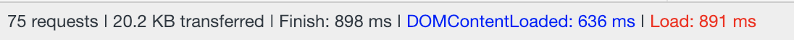
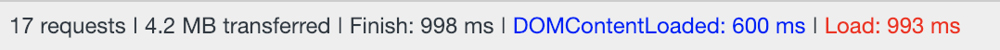
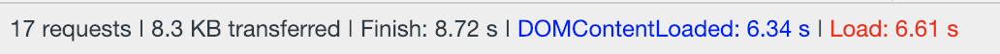
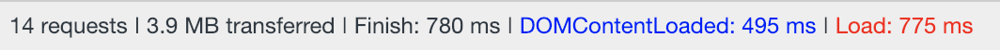
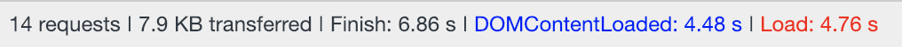
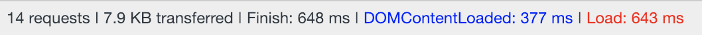
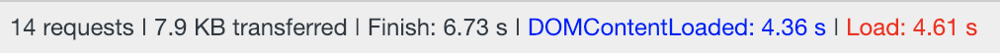
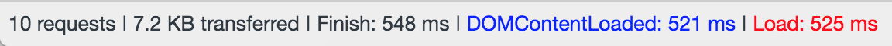
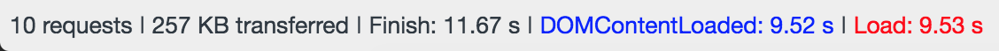

# Exhibit A

I want a project to showcase a variety of technologies, techniques and interesting ideas.

# Table of Contents

1. [ Run this App ](#desc)
2. [ Current Integration List ](#currentlist)
3. [ Refinement ](#refinement)
4. [ Coming Plans ](#comingplans)
5. [ Performance Metrics ](#performance)
6. [ Posterity ](#posterity)
7. [ Captains Log ](#captainslog)

<a name="runthisapp"></a>

## Run this App

1. Clone repo to local directory.
2. Make sure npm and bower are installed globally. (`npm -v` and `bower -v`).
    - Not Installed? Install NPM and Bower globally with `npm i -g` and `bower i -g`.
3. Execute `npm i; bower i` within the command line whilst in the project directory.
4. Create and supply JSON for Google Auth secrets in credentials.json (see below)
5. run `npm run start` to compile the app and spin up the local server.
6. Head to the local url in the browser

*Note:* if you wish to test on your mobile device locally, you need to run `ng serve --host=[your ip address]`

<a name="currentlist"></a>

## Current Integration List

- Angular 6
	- CLI
	- PWA
	- SCSS
	- TypeScript
	- NPM
  - Bower
  - Karma
  - Custom UI Components
  - Router
  - Route Transitions
	- Auth Guards for Protected Routes
- NgRx - State Management
- Angular Material - Prebuilt Components & Styles
- HammerJS - Mobile Gesture Support
- Git
- Lodash
- Google Authentication
- Web Components (Vaadin)
- Font Icons (Simple Line Icons)

<a name="refinement"></a>

## Refinement

- Route transitions need to be worked on.
- So far, no unit tests have been written.
- Store Google Auth data in NgRx Store AND a cookie to persist auth
- Route "resolves" for pre view load logic 

<a name="comingplans"></a>

## Coming Plans

- API Services
- Heroku Connection
- Micro Interactions
	- Disable Button On API Call
	- Drag and Drop "Cards"
		- Store Content in DB
		- Store Coordinates in DB
		- Store Size of Card in DB
	- Cross-State Notifications
	- New List Item Entrance
	- Scroll to Item
	- Accordion
	- Infinite Scroll?
	- Error Messages
- PWA: Offline Mode & Service Workers
- PWA: Push Notifications
- Vaadin Forms
- Track Users Progress Down Page (e.g. How much of a blog article was read)
- Session Handling in Node
- App & User Stats
	- Last Log In
	- Log in Frequency Block Chart
- Finance App - Ultimate Insight on Spending
	- CRUD
		- Read
		- Create
			- Merchant
			- Items
				- Cost Per, Free, Rewards, etc.
			- Sub Total
			- Grand Total (generate tax rate programmatically)
			- Category
			- Tag
	- Obligatory Bill Reminder Feature
	- Transactions Management
		- Configure recurring payments/bils
		- Apply a returned item flag on all or part of a transaction
		- Concealed transaction flag
	- Purchase History Breakdown
		- Spending by project, group, hobby, activity, etc..
			- See how much you've spent on your renovation, car restoration, and other projects or hobbies.
		- Spending by category
			- Spending by category (or all) comparisons by day, week, month, year, or random
		- Spending by tag
		- Spending by merchant
			- Pie chart of top spending groups by merchant
		- Spending by credit/debit card
		- How much has been spent on tax?
		- No spending streaks
		- Analytical insights on spending
			- e.g. "you spent 3x more this week at starbucks than you have for the past 3 weeks...", etc. 
		- NOTE: able to add exceptions for purchases that would tip the scales and generate false positives
		- NOTE: enable a way to track how much has been save through coupons, rewards, gifts, or free items
		- NOTE: add a feature to allow the user to configure custom attributes that can be used to filter on and analyze 
- Recruiter Communication Tracker App
- Medication Consumption Tracker App


<a name="performance"></a>

# Performance Metrics

### **1-04-2019**
> Lumo Styles (Icons are killing the load time for slow 3g)

Regular WIFI (122.3 Mbps download speed)       


Slow 3G                          


---

### **1-03-2019**
> Web Component Configuration & Shims

Regular WIFI (122.3 Mbps download speed)       


Slow 3G                          



---

### **1-01-2019**
> Custom Angular Header Component & Router (no affect on performance) Implementation

Regular WIFI (122.3 Mbps download speed)       


Slow 3G                          



---

### **12-19-2018**
> Google Auth implementation

Regular WIFI (122.3 Mbps download speed)       


Slow 3G                          



---

### **12-12-2018**
> Boilerplate Angular CLI application with angular-pwa

Regular WIFI (122.3 Mbps download speed)       


Slow 3G                          


<a name="posterity"></a>

# Posterity

- TODO: NgRx Flow Chart
- TODO: How to configure web components
- TODO: Google Auth Outline

## Credentials.json

If this app is forked or pulled down, it will not successfully build. I have a credentials.json file in the root project folder containing Google Auth's secrets. The credentials.json is imported into the app.module.ts file and is required for this app to work. This json structure was retrieved from the Google API console and follows this format:

```
{ 
  "web": {
    "client_id":"GOOGLE_API_CLIENT_ID",
    "project_id":"GOOGLE_API_PROJECT_ID",
    "auth_uri":"https://accounts.google.com/o/oauth2/auth",
    "token_uri":"https://www.googleapis.com/oauth2/v3/token",
    "auth_provider_x509_cert_url":"https://www.googleapis.com/oauth2/v1/certs",
    "client_secret":"GOOGLE_API_SECRET",
    "redirect_uris":["http://localhost:4200"],
    "javascript_origins":["http://localhost:4200"]
  }
}
```

<a name="captainslog"></a>

# Captains Log

- 1/22/19: convert angular cli project to use SCSS - https://github.com/angular/angular-cli/wiki/stories-css-preprocessors
- 1/20/19: using ngrx for state and authentication - https://mherman.org/blog/authentication-in-angular-with-ngrx/
- 1/19/19: `(<any>this.actions).ofType( ... )` needed to avoid typing error.
- 1/19/19: When using `ng generate service [service-name]` you must define the module like so: `ng generate service services/auth --module=app`.
- 1/18/19: A security vulnerability was detected by Github. the origins of this appear to be angular devkit. Look into upgrading devkit to resolve this vulnerability.
- Needed to update the base url in index.html in order for prod build to work (apache and http-server).
- Revision 393987 - To Read a JSON file in TS, a type declaration is needed for a successful import.
  - https://hackernoon.com/import-json-into-typescript-8d465beded79