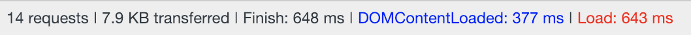

# Exhibit A

I want a project to showcase a variety of front-end web technologies.

## The List

- Angular 6
  - Typescript
  - NPM
- PWA

## Coming Plans

- Google Auth 
- Custom Elements
- Web Components
- Router
- Forms
- APIs
- Large Lists
  - Infinite Scroll?

# Performance Marks

**12-19-2018**
Google Auth implementation

Regular WIFI (122.3 Mbps download speed)       

Slow 3G                          

---

**12-12-2018**
Boilerplate Angular CLI application with angular-pwa

Regular WIFI (122.3 Mbps download speed)       

Slow 3G                          

# Notes

- Needed to update the base url in index.html in order for prod build to work (apache and http-server)