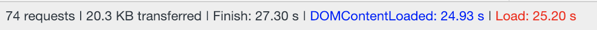

# Exhibit A

I want a project to showcase a variety of technologies in Angular.

## Current Integration List

- Angular 6
	- CLI
	- PWA
	- TypeScript
	- NPM
	- Karma
	- Custom UI Components
	- Router
	- Route Transitions
	- NgRx - State Management
	- Angular Material - Prebuilt Components
- HammerJS - Mobile Gesture Support
- Git
- Lodash
- Google Authentication
- Web Components
- Font Icons (simple line icons)

## Refinement

- Store Google Auth data in NgRx Store to persist auth.
- Have header reflect auth state (could even just be a different background color).
- Route transitions need to be worked on.
- So far, no unit tests have been written.
- Route interceptor / activateRoute for page protection based on auth.
- Route "resolves" for pre view load logic 

## Coming Plans

- Configure SCSS
- API Services
- Heroku Connection
- Micro Interactions
	- Disable Button On API Call
	- Drag and Drop "Cards"
		- Store Content in DB
		- Store Coordinates in DB
		- Store Size of Card in DB
	- Cross-State Notifications
	- New List Item Entrance
	- Scroll to Item
	- Accordion
	- Infinite Scroll?
	- Error Messages
- PWA: Offline Mode & Service Workers
- PWA: Push Notifications
- Vaadin Forms
- Track Users Progress Down Page (e.g. How much of a blog article was read)
- Session Handling in Node
- App & User Stats
	- Last Log In
	- Log in Frequency Block Chart
- Finance App - Ultimate Insight on Spending
	- CRUD
		- Read
		- Create
			- Merchant
			- Items
				- Cost Per, Free, Rewards, etc.
			- Sub Total
			- Grand Total (generate tax rate programmatically)
			- Category
			- Tag
	- Obligatory Bill Reminder Feature
	- Transactions Management
		- Configure recurring payments/bils
		- Apply a returned item flag on all or part of a transaction
		- Concealed transaction flag
	- Purchase History Breakdown
		- Spending by project, group, hobby, activity, etc..
			- See how much you've spent on your renovation, car restoration, and other projects or hobbies.
		- Spending by category
			- Spending by category (or all) comparisons by day, week, month, year, or random
		- Spending by tag
		- Spending by merchant
			- Pie chart of top spending groups by merchant
		- Spending by credit/debit card
		- How much has been spent on tax?
		- No spending streaks
		- Analytical insights on spending
			- e.g. "you spent 3x more this week at starbucks than you have for the past 3 weeks...", etc. 
		- NOTE: able to add exceptions for purchases that would tip the scales and generate false positives
		- NOTE: enable a way to track how much has been save through coupons, rewards, gifts, or free items
		- NOTE: add a feature to allow the user to configure custom attributes that can be used to filter on and analyze 
- Recruiter Communication Tracker App
- Medication Consumption Tracker App

# Performance Metrics

### **1-04-2019**
> Lumo Styles (Icons are killing the load time for slow 3g)

Regular WIFI (122.3 Mbps download speed)       

Slow 3G                          

---

### **1-03-2019**
> Web Component Configuration & Shims

Regular WIFI (122.3 Mbps download speed)       

Slow 3G                          

---

### **1-01-2019**
> Custom Angular Header Component & Router (no affect on performance) Implementation

Regular WIFI (122.3 Mbps download speed)       

Slow 3G                          

---

### **12-19-2018**
> Google Auth implementation

Regular WIFI (122.3 Mbps download speed)       

Slow 3G                          

---

### **12-12-2018**
> Boilerplate Angular CLI application with angular-pwa

Regular WIFI (122.3 Mbps download speed)       

Slow 3G                          

# Captains Log

- 1/18/19: A security vulnerability was detected by Github. the origins of this appear to be angular devkit. Look into upgrading devkit to resolve this vulnerability.
- Needed to update the base url in index.html in order for prod build to work (apache and http-server).
- Revision 393987 - To Read a JSON file in TS, a type declaration is needed for a successful import.
  - https://hackernoon.com/import-json-into-typescript-8d465beded79